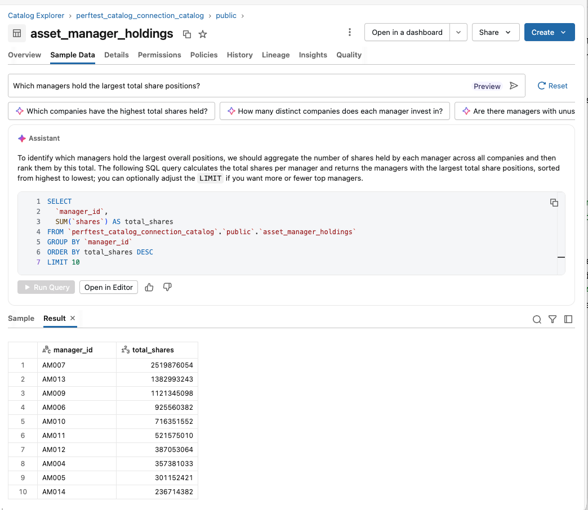

# Federated Lakebase Demo Proposal

## What We're Building and Why

When we talk about what the Neo4j connector would gain by becoming an official Databricks federated data source, the conversation stays abstract. This demo makes it concrete.

Lakebase, Databricks' managed PostgreSQL, is already an official federated data source. That means every capability in unlock.md that Neo4j is working toward, Lakebase has today. The proposal is simple: build a standalone demo using Lakebase and the existing financial holdings dataset to show each capability in a live walkthrough, so that when we say "this is what Neo4j would look like," we have a running reference instead of a slide deck.

The demo uses financial data that already exists in the repo: companies, asset managers, holdings positions, and financial metrics. Berkshire Hathaway's portfolio makes for a natural, recognizable story that a technical audience will follow without needing domain context.

## The Demo Story

A portfolio analyst at a firm that manages large institutional investors wants to answer questions about who holds what. The data lives in a Lakebase PostgreSQL database, not in Delta tables, not in a data warehouse, just a PostgreSQL database managed by Databricks. The analyst should be able to discover that data, query it with appropriate permissions, build a dashboard from it, and ask questions about it in plain English. None of those things should require an ETL pipeline, a materialization job, or a copy of the data in another system.

That is the story. Everything below is a scene in it.

## Scenario 1: Catalog-Level Integration

Without official federation, a database is a black box. You connect to it if you know the hostname and credentials, and you have no idea what's inside until you're already in.

With Lakebase as an official federated source, the PostgreSQL database registers as a named catalog in Unity Catalog. The analyst opens Catalog Explorer and sees a catalog called something like `lakebase_financial`. Inside it are schemas and tables: `companies`, `asset_managers`, `asset_manager_holdings`, and `financial_metrics`, all browsable like any other table in the lakehouse. The analyst can read the column names, see row counts, read any attached descriptions, and understand what data is available before writing a single query.

This is what catalog-level integration means in practice: the data source becomes discoverable without anyone having to explain it. For Neo4j, this would mean node labels and relationship types appearing as tables in Catalog Explorer automatically, not via a manual sync job.

### Setup

**Step 1: Configure and deploy the Lakebase instance.**

Copy `deploy-lakebase/.env.sample` to `deploy-lakebase/.env` and set the two values:

```
LAKEBASE_PROJECT_NAME=lakebase-flb-demo
DATABRICKS_PROFILE=azure-rk-knight
```

Then run the deploy script:

```bash
./deploy-lakebase/deploy.py deploy
```

The script creates the Lakebase project, generates an OAuth credential, and writes a connection file to `deploy-lakebase/lakebase-flb-demo-connection.json`. The JSON contains everything needed for the next steps:

```json
{
  "project": "lakebase-flb-demo",
  "branch": "main",
  "endpoint": "main",
  "connection": {
    "host": "<your-instance>.lakebase.databricks.com",
    "port": 5432,
    "database": "databricks_postgres",
    "username": "you@company.com",
    "password": "<oauth-token>",
    "token_expires": "2026-04-09T22:00:00Z",
    ...
  }
}
```

**The OAuth token expires after one hour.** Run `./deploy-lakebase/deploy.py refresh` to generate a fresh token and overwrite the connection file before the demo.

**Step 2: Load the financial data.**

```bash
./deploy-lakebase/test_lakebase.py
```

This creates the four tables (`companies`, `asset_managers`, `asset_manager_holdings`, `financial_metrics`) in the `public` schema of the `databricks_postgres` database and loads all CSV data from `deploy-lakebase/data/`. It then runs a set of verification queries and prints row counts and sample results to confirm the data is in place.

**Step 3: Create the connection and foreign catalog in Catalog Explorer.**

Open the connection JSON and copy the `host`, `username`, and `password` fields, then paste them into the wizard.

1. In your Databricks workspace, click **Catalog** in the left sidebar.
2. At the top of the Catalog pane, click the **+** Add icon and select **Create a connection**.
3. Enter a connection name: `lakebase_financial_conn`. Select **PostgreSQL** as the connection type. Click **Next**.
4. Fill in the authentication details from the connection JSON:
   - **Host**: `connection.host`
   - **Port**: `5432`
   - **User**: `connection.username`
   - **Password**: `connection.password`
5. Click **Create connection**.
6. On the Catalog basics page:
   - **Catalog name**: `lakebase_financial`
   - **Database**: `databricks_postgres`
   - Click **Test connection** to confirm it reaches the instance, then click **Create catalog**.
7. On the Access page, select **All workspaces have access**. Set yourself as owner. Click **Next**, then **Save**.

**Step 4: Verify the catalog is browsable.**

Navigate to `lakebase_financial` in the Catalog pane. Open the `public` schema. You should see four tables: `companies`, `asset_managers`, `asset_manager_holdings`, and `financial_metrics`. Click any table to see column names, data types, and row count with no query written.

Click the **Sample Data** tab on any table to preview rows directly in Catalog Explorer. The screenshot below shows the `asset_manager_holdings` table with its sample data, which is the view that makes the point to the audience: PostgreSQL data browsable inside Unity Catalog, identical to the experience with a Delta table.



This is the moment to pause during the walkthrough. The audience is looking at PostgreSQL data inside Unity Catalog, with the same schema browsing experience they get for Delta tables.

## Scenario 2: Governance and Access Control

The portfolio holdings data is sensitive. Not everyone should see who holds what. Today, without official federation, the only lever available is connection-level access: either you have the credentials to the database or you don't. There is no middle ground.

With Lakebase as an official federated source, access works at the table level through standard Unity Catalog grants. The compliance team can give analysts permission to query `companies` and `asset_managers` but restrict access to `asset_manager_holdings` to a smaller group. No one with restricted access can see Berkshire's positions even if they know the database hostname.

Beyond access control, audit logging happens automatically. Every query against a Lakebase table, including which analyst ran it, which notebook or job it came from, which table was touched, and at what time, shows up in Unity Catalog's system audit log. The compliance team does not need to configure anything to get this. It is on by default.

Column-level lineage works the same way. When the dashboard built in Scenario 4 reads the `shares` column from `asset_manager_holdings`, Unity Catalog records that automatically. A data steward can trace exactly which downstream reports depend on which upstream columns in the PostgreSQL database.

For Neo4j, this is the difference between connection-level governance that today requires workarounds and the kind of per-table, per-column governance that regulated industries actually need.

### Setup

Run the following SQL in a notebook or the SQL query editor to create a group called `analysts` and grant it access to reference tables only. The holdings data is withheld:

```sql
-- Grant access to the catalog and schema
GRANT USE CATALOG ON CATALOG lakebase_financial TO `analysts`;
GRANT USE SCHEMA ON SCHEMA lakebase_financial.public TO `analysts`;

-- Allow reads on reference tables
GRANT SELECT ON TABLE lakebase_financial.public.companies TO `analysts`;
GRANT SELECT ON TABLE lakebase_financial.public.asset_managers TO `analysts`;

-- Do NOT grant SELECT on asset_manager_holdings or financial_metrics
```

To show the current permission state in Catalog Explorer: navigate to `lakebase_financial` → `public` → `asset_manager_holdings`, click the **Permissions** tab. The `analysts` group does not appear.

### Verification test

Log in as or impersonate a user in the `analysts` group. From a SQL warehouse:

```sql
-- This succeeds — analysts can read reference data
SELECT name, ticker FROM lakebase_financial.public.companies LIMIT 10;

-- This fails — analysts cannot see position data
SELECT * FROM lakebase_financial.public.asset_manager_holdings LIMIT 10;
-- Expected error: PERMISSION_DENIED: User does not have SELECT privilege on table...
```

**Show the audit trail.** Every query attempt, including the denied one, appears in the system audit log automatically. No configuration required:

```sql
SELECT
  event_time,
  user_name,
  action_name,
  response.status_code AS status
FROM system.access.audit
WHERE event_time > current_timestamp() - INTERVAL 1 HOUR
  AND service_name = 'databricks.sql'
ORDER BY event_time DESC
LIMIT 20;
```

**Show column-level lineage** after the dashboard in Scenario 4 has been published:

1. Click **Catalog** in the sidebar.
2. Navigate to `lakebase_financial` → `public` → `asset_manager_holdings`.
3. Click the **Lineage** tab.
4. The `shares` column shows a downstream lineage edge to the AI/BI dashboard dataset. Unity Catalog recorded this when the dashboard first ran its query.

## Scenario 3: Genie

Genie is where official federation makes the biggest visible difference, because today Genie requires Delta tables. To ask a natural language question about Neo4j or PostgreSQL data today, you first have to copy that data into Delta, and then Genie queries the copy. That copy goes stale the moment the source changes.

With Lakebase as an official federated source, we create a Genie Space pointed directly at the `lakebase_financial` catalog. The analyst types: "Which asset manager holds the most shares overall?" and Genie translates that into SQL, runs it against the live Lakebase tables, and returns the answer. No intermediate Delta table. No freshness problem. The analyst then asks a follow-up: "Show me Berkshire Hathaway's top ten holdings by share count" and Genie answers that too, in the same session, from the same live source.

This scenario is the clearest illustration of what official federation unlocks, because the contrast is so direct. Either you can point Genie at your database or you can't. With Lakebase, you can. With the Neo4j custom JDBC connector today, you cannot.

### Setup

**Requirements:** A pro or serverless SQL warehouse; `SELECT` privileges on the `lakebase_financial` catalog tables for the Genie space author.

**Create the Genie Space:**

1. Click **Genie** in the left sidebar.
2. Click **New** in the upper-right corner.
3. In the **Connect data** dialog, navigate to `lakebase_financial` → `public` and select all four tables: `asset_manager_holdings`, `asset_managers`, `companies`, `financial_metrics`. Click **Create**.
4. Click **Configure** → **Settings**. Set:
   - **Title**: `Portfolio Holdings`
   - **Default warehouse**: select a serverless SQL warehouse
5. Click **Save**.

**Add example queries** to make Genie reliable on the questions you plan to ask. Click **Configure** → **Instructions** → **SQL Queries** → **Add** for each:

```sql
-- "Which asset manager holds the most shares overall?"
SELECT am.name, SUM(h.shares) AS total_shares
FROM lakebase_financial.public.asset_manager_holdings h
JOIN lakebase_financial.public.asset_managers am
  ON h.manager_id = am.manager_id
GROUP BY am.name
ORDER BY total_shares DESC
LIMIT 1;
```

```sql
-- "Show me Berkshire Hathaway's top ten holdings by share count"
SELECT c.name AS company, c.ticker, h.shares
FROM lakebase_financial.public.asset_manager_holdings h
JOIN lakebase_financial.public.companies c
  ON h.company_id = c.company_id
JOIN lakebase_financial.public.asset_managers am
  ON h.manager_id = am.manager_id
WHERE am.name = 'Berkshire Hathaway Inc.'
ORDER BY h.shares DESC
LIMIT 10;
```

**Add general instructions** (Configure → Instructions → Text tab):

```
- asset_manager_holdings connects managers to companies via manager_id and company_id
- shares is an integer count of shares held, not a percentage or dollar value
- Berkshire Hathaway's manager_id is 'AM006'
- When asked about a portfolio, join asset_manager_holdings to companies on company_id
- financial_metrics contains named metric values (e.g. revenue, operating income) per company and period
```

### Test prompts

Run these before the demo to verify the space is working. Click **New chat** for each group so you are testing from a clean context. If a prompt returns an error or a nonsense answer, add or refine the example query for that prompt before the call.

**Basic aggregations, which should return immediately with a clean table:**

- "Which asset manager holds the most shares overall?"
- "Show me the top 5 asset managers by total shares held."
- "How many asset managers are in the dataset?"
- "What is the total number of shares held across all managers and companies?"

**Joins and filtering, which tests that Genie can navigate the foreign keys:**

- "Show me Berkshire Hathaway's top ten holdings by share count."
- "Which companies does Berkshire Hathaway hold a position in?"
- "List all asset managers that hold Apple stock."
- "Which asset managers hold positions in both Apple and Microsoft?"

**Counts and follow-ups, which tests conversational continuity within a session:**

- "How many distinct companies does Berkshire hold a position in?"
- Then ask: "Which of those has the most shares?"
- "Which company has the highest total share ownership across all managers?"
- Then ask: "How many managers hold that company?"

**Edge cases to confirm Genie handles these gracefully:**

- "What percentage of all shares does Berkshire hold?" *(requires computing a ratio, watch whether Genie attempts it or asks for clarification)*
- "Which companies have only one manager holding them?"
- "Show me managers that hold more than 10 different companies."

### Demo questions to ask live

Type these in order during the walkthrough. Do not replay canned prompts.

1. "Which asset manager holds the most shares overall?"
2. "Show me Berkshire Hathaway's top ten holdings by share count."
3. "How many distinct companies does Berkshire hold a position in?"
4. "Which company has the highest total share ownership across all managers?"

Each answer comes directly from the live Lakebase tables. Click **Show code** on any response to show the generated SQL to the audience.

## Scenario 4: AI/BI and Analytics

The analyst wants a dashboard. Today, without official federation, building a dashboard on PostgreSQL data means one of two things: either connect directly to the database and accept that you have no governance, or materialize the data into Delta tables first and accept that you're maintaining an ETL pipeline to keep it current.

With Lakebase as an official federated source, the analyst creates an AI/BI dashboard that queries the Lakebase tables directly. No Delta tables. No pipeline. The dashboard shows top asset managers ranked by total shares held, a breakdown of Berkshire's portfolio by company, and a summary of total positions across all managers. The data in the charts is live, reflecting whatever is currently in the PostgreSQL database.

The same SQL warehouse that powers every other Databricks dashboard also powers this one. There is nothing special to configure and no separate connection to manage. From the dashboard author's perspective, the Lakebase tables look identical to Delta tables.

For Neo4j, this would mean graph data queryable via standard Databricks SQL, enabling dashboards built directly on top of graph-backed foreign tables without materializing anything into Delta first.

### Setup

**Create the dashboard:**

1. Click **New** in the left sidebar and select **Dashboard**.
2. Click the **Data** tab, then **Create from SQL**.

**Define three datasets.** For each: paste the query, click **Run** to verify rows return, then double-click the dataset name to rename it.

**Dataset 1: Top asset managers by total shares:**

```sql
SELECT
  am.name         AS asset_manager,
  SUM(h.shares)   AS total_shares
FROM lakebase_financial.public.asset_manager_holdings h
JOIN lakebase_financial.public.asset_managers am
  ON h.manager_id = am.manager_id
GROUP BY am.name
ORDER BY total_shares DESC
LIMIT 15;
```

**Dataset 2: Berkshire Hathaway portfolio:**

```sql
SELECT
  c.name      AS company,
  c.ticker,
  h.shares
FROM lakebase_financial.public.asset_manager_holdings h
JOIN lakebase_financial.public.companies c
  ON h.company_id = c.company_id
JOIN lakebase_financial.public.asset_managers am
  ON h.manager_id = am.manager_id
WHERE am.name = 'Berkshire Hathaway Inc.'
ORDER BY h.shares DESC;
```

**Dataset 3: Portfolio summary:**

```sql
SELECT
  COUNT(DISTINCT manager_id)  AS manager_count,
  COUNT(DISTINCT company_id)  AS company_count,
  SUM(shares)                 AS total_shares_held
FROM lakebase_financial.public.asset_manager_holdings;
```

**Add visualizations:**

1. Click the **Canvas** tab, then click **Add a visualization**.
2. From Dataset 1: select **Bar** chart, set X-axis to `asset_manager` and Y-axis to `total_shares`. Title the widget "Top 15 Asset Managers by Shares Held."
3. Add a second visualization from Dataset 2: **Bar** chart, X-axis `company`, Y-axis `shares`. Title it "Berkshire Hathaway Portfolio."
4. Add three **Counter** widgets from Dataset 3, one each for `manager_count`, `company_count`, and `total_shares_held`.
5. Click **Publish** → **Share with data permissions (default)** → **Publish**.

### Verification test

To show the data is live and not cached: update a value directly in the Lakebase PostgreSQL database, then reload the dashboard.

Using a psycopg connection in a notebook (see `lakebase-provisioned` skill for connection setup):

```python
# Add 1 million shares to Berkshire's Apple position
cur.execute("""
  UPDATE asset_manager_holdings
  SET shares = shares + 1000000
  WHERE manager_id = 'AM006' AND company_id = 'C002'
""")
conn.commit()
```

Reload the published dashboard. The Berkshire chart updates immediately. No pipeline rerun, no cache invalidation step. The next query hits the live PostgreSQL row.

## What This Proves

Each scenario above is a concrete, runnable demonstration of a capability described in unlock.md. Together they show what a database looks like once it becomes a first-class citizen of the Unity Catalog ecosystem: discoverable, governed, queryable from dashboards, and accessible to Genie.

The goal is not to build a polished product. The goal is to have something we can walk the Neo4j team through live that makes the abstract concrete: "This is what your connector would look like. The only difference is that today we're doing it with Lakebase, and you are one official integration away from the same thing."

## How We'll Run It

The demo is a live walkthrough, not a recorded video or a self-service kit. Each scenario is shown sequentially in a single Databricks workspace with the financial holdings data already loaded.

Three of the four scenarios can be fully scripted and will be in a predictable state before the call: Catalog Explorer, governance grants, and the AI/BI dashboard. The Genie Space requires manual setup in the workspace ahead of time, since Genie configuration is not currently scriptable via the CLI or API. The Genie Space needs to be created, pointed at the Lakebase foreign catalog, and tested before the walkthrough begins. During the demo, it is shown live, with the presenter typing questions in real time rather than replaying a canned prompt.

The `deploy-lakebase/deploy.py` script handles provisioning the Lakebase instance and writing connection credentials. `deploy-lakebase/test_lakebase.py` creates the schema and loads the financial data. The remaining setup, covering foreign catalog registration, permission grants, dashboard creation, and Genie Space configuration, is done manually in the workspace once before the demo and left in place.

**Pre-demo checklist:**

- [ ] `.env` configured in `deploy-lakebase/` with project name and profile
- [ ] `./deploy-lakebase/deploy.py deploy` run successfully; connection JSON present in `deploy-lakebase/`
- [ ] `./deploy-lakebase/test_lakebase.py` run successfully; row counts confirmed in output
- [ ] OAuth token refreshed within the hour before the demo: `./deploy-lakebase/deploy.py refresh`
- [ ] `lakebase_financial` foreign catalog visible in Catalog Explorer with all four tables; Sample Data tab loads rows
- [ ] `analysts` group created and grants applied; access denial verified with a test user
- [ ] Portfolio Holdings dashboard published and displaying correct data
- [ ] Genie Space created, all four tables added, example queries loaded, and each demo question tested
- [ ] Serverless SQL warehouse running (avoids cold-start delay during the walkthrough)
